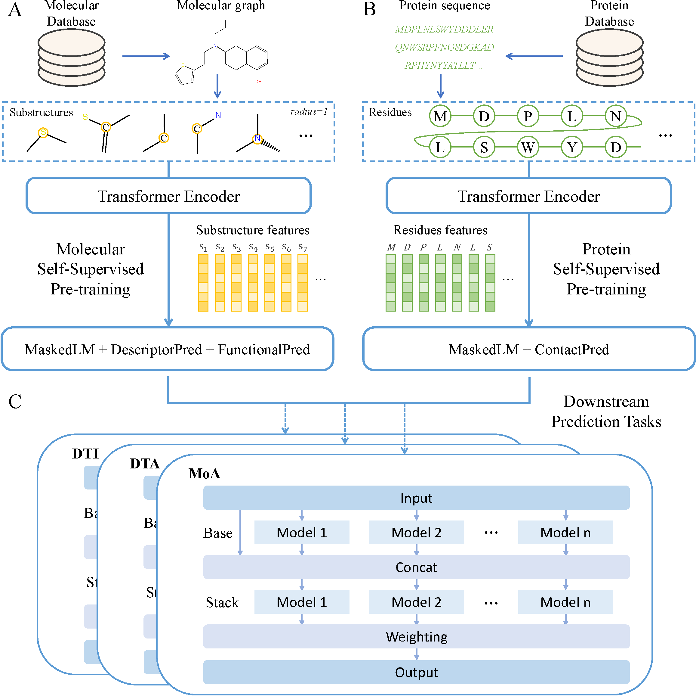

## DTIAM: A unified framework for predicting drug-target interactions, binding affinities and activation/inhibition mechanisms

Official implementation of DTIAM, a unified framework for predicting drug-target interactions, binding affinities and activation/inhibition mechanisms, by Zhangli Lu. Please contact me if you are interested in my work and look for academic collaboration (Email: luzhangli@csu.edu.cn).

## DTIAM
<div align="center">  

</div>

## Setup and dependencies
#### Dependencies:
```
- python 3.7
- pytorch 1.12.1
- autogluon 0.5.2
- dill 0.3.4
- fair_esm 2.0.0
- joblib 1.1.0
- numpy 1.21.2
- pandas 1.3.5
- rdkit 2022.9.5
- setuptools 59.8.0
- tqdm 4.62.2
```

#### Conda environment
```bash
# Run the commandline
conda create -n dtiam python=3.7 -y
conda activate dtiam
conda install pytorch==1.12.1 torchvision==0.13.1 torchaudio==0.12.1 cudatoolkit=11.3 -c pytorch -y
pip install -r requirements.txt
cd BerMol
pip install -e .
```

## Data sets

This repository contains six benchmark datasets, namely Yamanishi_08, Hetionet, Davis, KIBA, Activation and Inhibition, which are used for three prediction tasks: drug-target interaction (DTI) prediction, drug-target affinity (DTA) prediction, and mechanism of action (MoA) prediction. The raw data of these benchmark datasets can be found in ./data/. 

#### Data preparation

Before running the DTIAM model in ./code/, please first use ./code/data_prepare.sh to produce necessary files.

## Pre-trained models

The complement of the self-supervised molecular representation learning model BerMol can be found in ./code/BerMol/. The pre-trained model (BerMolModel_base.pkl) could be downloaded from this [Link](https://drive.google.com/file/d/1ZW-PQXE4FvWHx77hkUA-JsqyJUb6B-NQ/view?usp=drive_link).

## Training

Starting a new training run:
```bash
python training_validation.py <task> <dataset> <experimental setting>
```
The options for task include dti, dta, and moa, the options for dataset include yamanishi_08, hetionet, davis, kiba, activation, and inhibition, and the options for experimental setting include warm_start, drug_coldstart, and protein_coldstart.

For example, in moa task, using activation dataset and warm_start setting, run:
```bash
python training_validation.py moa activation warm_start
```

And in dti task, using yamanishi_08 dataset and protein_coldstart setting, run:
```bash
python training_validation.py dti yamanishi_08 protein_coldstart
```

And so on.
